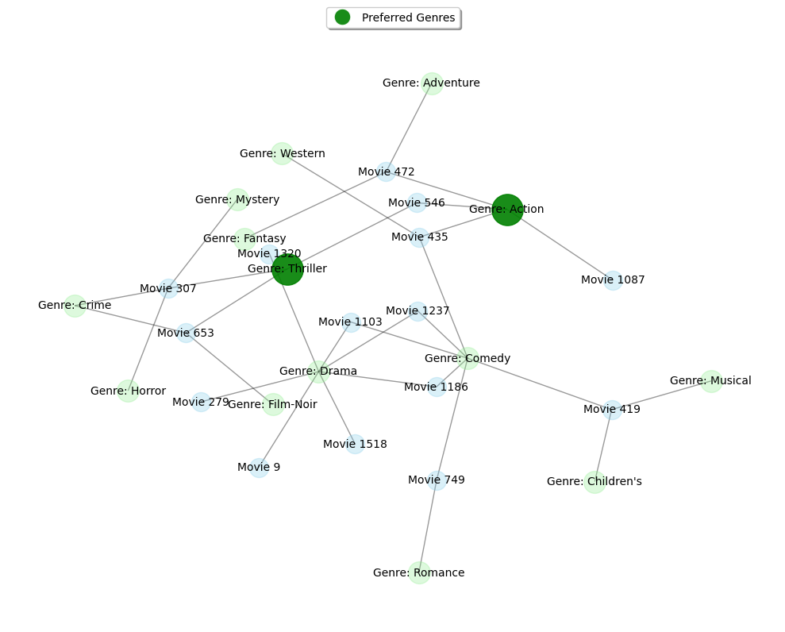

# LLM-Driven Cold Start Recommendation System

Our ultimate goal in this project is to leverage the reasoning and conversational capability of LLMs to tackle cold start problems in recommendation system

## 🚀 What is our initial plan?
- **Cold Start Focus**: Tailored for scenarios with minimal or no user-item interaction.
- **Tree-Based Retrieval**: Dynamic hierarchical item tree built using semantic similarity to improve recommendation efficiency.
- **Hybrid Prompt Engineering**: Separates task prompts (general knowledge) from domain prompts (context-specific), enhancing adaptability.
- **Lightweight Deployment**: Designed to be effective even in resource-constrained environments.

## 📌 Where we are at now?

We conducted a comparative analysis of four recommendation strategies to address the cold start problem:

### 🔁 1. Collaborative Filtering (CF)
- Based on **user-user similarity** using **Pearson correlation**.
- Predicts ratings through a **weighted average** of neighbors' normalized ratings.
- Performance is limited in cold start scenarios due to the lack of interaction history.

### 🧠 2. Knowledge Graph (KG)
- Built a **bipartite graph** linking movies to genres.
- For each user, identifies **preferred genres** (rating ≥ 4) and recommends unseen items in those genres.
- Ranking is based on **genre overlap** and **popularity**.
- Works well without needing LLMs or embeddings.

### 🌐 3. Graph-Based Retrieval (GR)
- Constructs a user profile and traverses a **genre-based graph** to retrieve candidate items.
- Scores candidates by matching genre weights and popularity.
- Outperforms other methods in all evaluation metrics, especially for cold start.

### 🤖 4. Cross Encoder Transformer Embeddings (CETE)
- Two-stage recommendation:
  1. **FAISS-based nearest neighbor search** for candidate generation.
  2. **Cross-encoder model** for semantic reranking using user-item pairs.
- Efficient but **underperforms** without domain knowledge or LLM integration.

### 📊 Model Performance

| Model | P@5 | R@5 | N@5 |
|-------|-----|-----|-----|
| CF    | 0.012 | 0.006 | 0.011 |
| KG    | 0.055 | 0.030 | 0.063 |
| GR    | **0.098** | 0.026 | **0.114** |
| CETE  | 0.034 | 0.022 | 0.038 |

| Model | P@10 | R@10 | N@10 |
|-------|------|------|------|
| CF    | 0.013 | 0.014 | 0.015 |
| KG    | 0.046 | 0.049 | 0.062 |
| GR    | **0.077** | 0.041 | **0.101** |
| CETE  | 0.030 | 0.043 | 0.042 |

As expected, the tree based retrieval, graph retrieval and Simplified Bipartate Knowledge Graph performed better than Colloborative Filtering.
Interestingly just a plain embedding by employing ms-marco-MiniLM-L6-v2 alone is not sufficient and hence compared to standalone BERT Embeddings or
pre-trained LLM, we need to have a specialized model specifically well trained on the same domain.

### ❄️ Cold Start Mitigation Effectiveness

- **New Users**: With a few ratings, the graph approach extracts genre preferences and finds semantically related items.
- **New Items**: New movies can be recommended immediately using genre metadata—no rating history required.

### 🧪 Knowledge Graph Visualization
We visualized how a genre-based graph enables recommendations for new users with only genre inputs.

## ⚠️ Known Limitations and Failures

- **Knowledge Distillation** was not fully successful due to the absence of a pre-trained domain-specific teacher model.
- Initial attempts show potential but require further tuning and alignment with the dataset.

## 🚧 Future Directions

- 🌳 **Graph-RAG Integration**: Enhance the graph method with LLM-based retrieval-augmented generation (RAG) for conversational recommendations.
- 📚 **Knowledge Distillation**: Leverage advanced prompt tuning and hybrid strategies combining domain knowledge with graph context.
- ⚡ **Dynamic Retrieval Optimization**: Improve the tree structure to adapt in real-time to evolving semantic relationships.

## References:

1. https://www.youtube.com/watch?v=JZi1hjB9C9g - Knowledge Graph Recommendation Systems for COVID 19
2. https://github.com/vatsalsaglani/GraphRAG4Rec - GraphRAG for Recommendation Demo
3. https://github.com/nancheng58/Awesome-LLM4RS-Papers - Contains a list of high quality research papers in the domain of LLMRec
